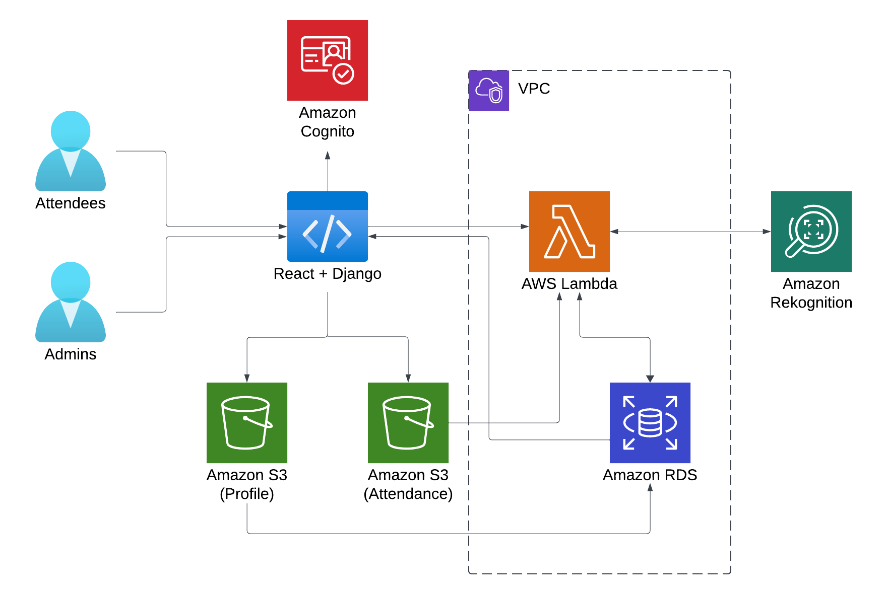

# Attendance Capturer

**Group 6 TripleSix**

💡 [Give it a try](https://attendance-capturer.onrender.com/) yourself! 💡

_Please be aware that loading the entire application may take some time._

Our application is designed to tackle the hassle of manual attendance. Taking attendance manually is inefficient, error-prone and might lead to disruptions when required check-in tokens (e.g. ID, membership card) are unavailable. It is also hard to get quick and useful insights from paper records. With our application, attendance-making is faster, more accurate, and less disruptive, as it is **a cloud-based automatic attendance system** that does not require physical check-in tokens.

Our application supports two workflows. The admin workflow starts with secure authentication with Amazon Cognito. Once logged in, admins can add/edit attendee profile pictures through the React frontend which are uploaded to the profile S3 bucket and the RDS database. The admins can also query the RDS database for both profile and attendance data for visualization purposes.  

For the second workflow, the attendees can use the React frontend to capture attendance photos and submit their profile IDs. The captured photos are uploaded to the attendance S3 bucket. Subsequently, the Lambda function is triggered with the URL of the attendance S3 object. It also queries the RDS database for the corresponding profile S3 object, then it makes an API call to Amazon Rekognition with both S3 objects to perform facial comparison. The result from Rekognition is returned to the Lambda function, which will insert the attendance data into the RDS database once facial comparison is confirmed to pass. 

The Lambda function and RDS database are set up to be inside a VPC, and the Lambda function uses VPC endpoints for accessing Rekognition and S3 services, which enhances the security of our application. Lastly, our application is fully deployed using Render.